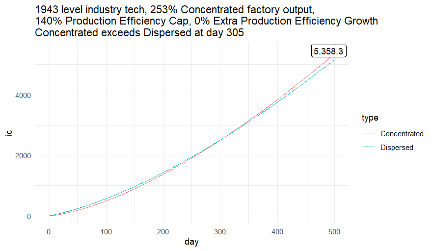
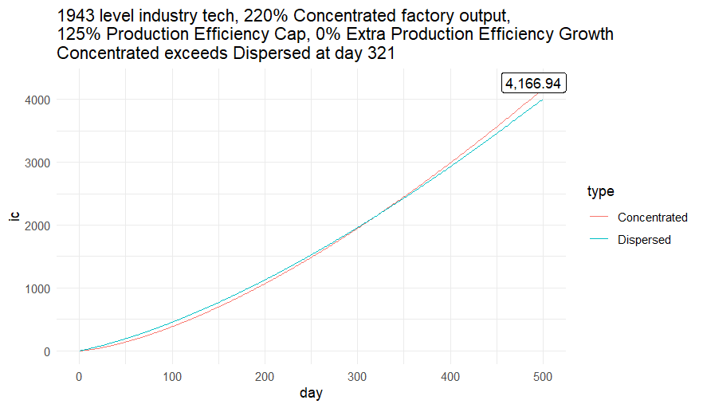
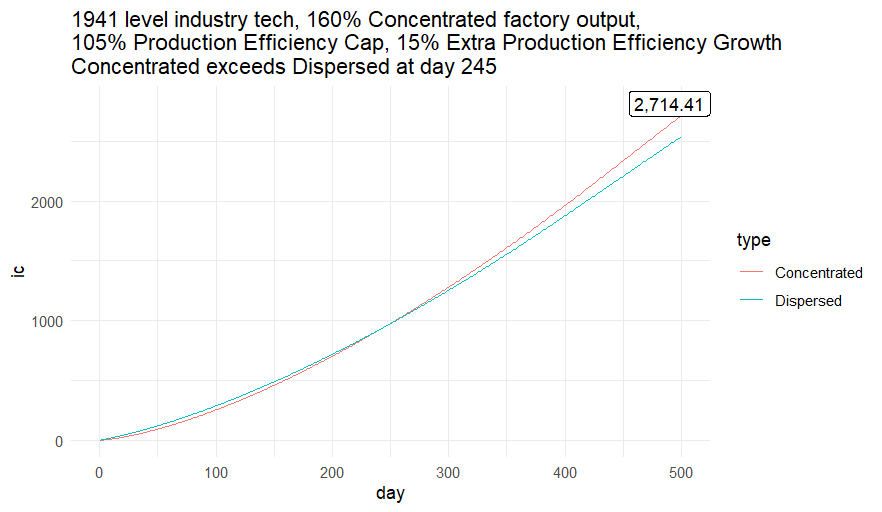
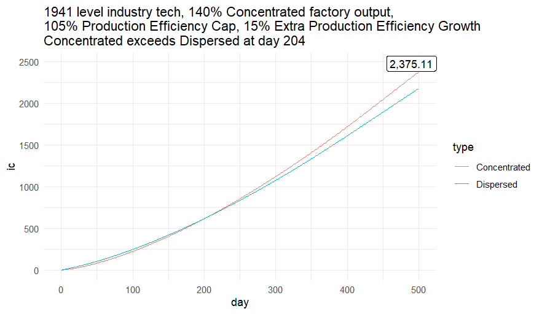
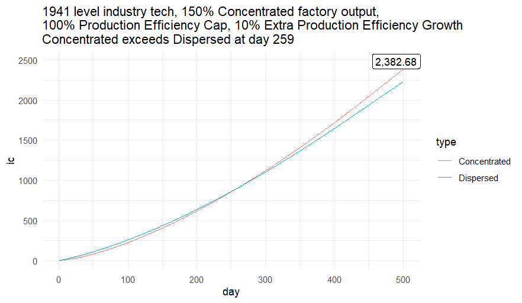

HOI4 is one of my guilty pleasures and for a long time I always knew that concentrated produces more equipment than dispersed after around a year. However, there are always people who try to argue why dispersed is better so I just wrote this program that plots out when production under concentrated exceeds dispersed.

All in all, you produce more with dispersed if you purposefully sabotage your industry by not researching industry techs. By the time you research to level 1939 industry tech levels (you can get them reliably around mid 1938), your factories will produce more equipment than diversed does within 500 days (or just about time for fall 1939 when you know what happens). 

However, when playing majors with a lot of buffs, that limit gets pushed much faster. All else equal:

1. The higher you can boost your production efficiency cap
2. The higher you can boost your production efficiency growth (cap is more important to grab)
3. The lower your factory output modifier (but why would you do that)

The faster your factories catch up to dispersed production under concentrated.

For reference, with how I play Rykov's path (strongest communist SOV path barring early COMECON), I can get to 253% factory output and 140% production efficiency cap and under those specs Concentrated is better than Dispersed by Day 305 of the factory's life. With Stalin as leader, you can't get such stats (because your advisors suck and don't have enough time to do all the focuses) so your factory produces more cumulatively under Concentrated after Day 321 and produce around 80% of what a factory under Rykov's path would produce after Day 500.

A few results:

Rykov's path (best no early COMECON Soviet path):

Stalin's path:

Germany under PEG (the better path because you get free trade):

Germany under 4YP using Goering as econ inner circle member:

Germany under 4YP using Speer as econ inner circle member:

